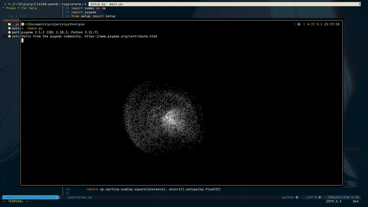

# (Not So) Particle Simulation



## Description

This is a simple project where i simulates particles movement with Particle Force/Velocity Adjustment and Particle Swarm Optimization.

## Dependencies

- [Pygame](https://www.pygame.org/) (for graphical rendering and handling simulation logic)

### Installing Dependencies

To run the simulation, you need to install the required dependencies. Use the following command:

```bash
pip install pygame
```

### How To Run

1. Clone the repository to your local machine:
```bash
git clone https://github.com/jiksrun/particle_simulation
```

2. Navigate to the project directory:
```bash
cd particle_simulation
```

3. Run the simulation
```bash
python main.py
```
